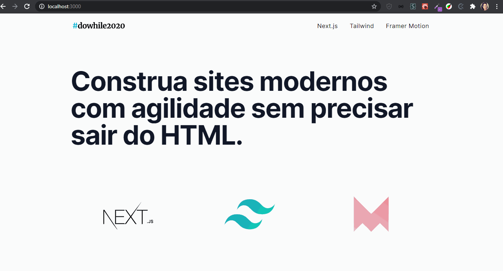

# Workshop - Next.js & TailwindCSS & Framer Motion com Guilherme Rodz

  
  

<blockquote align="center">“A chave para transformação é a continuidade. Continue a codar!”</blockquote>

 

 
 

## Apresentação 
 

  

 

## Sobre o workshop Nextjs Tailwind e Framer Motion
 

    No evento do DoWhile da Rocketseat o Guilherme Rodz nos apresentou em um workshop o NextJs, Tailwind e o Framer Motion para o desenvolvimento da aplicação acima.
    Esse workshop fica em aberto na plataforma da Rocketseat para quem participou do evento até dia 19/fev/2021.
    Então bora aproveitar e aprender um pouco das techs que estão sendo mais utilizadas!

 

## Tecnologias Utilizadas
 

- [x] Nextjs
- [x] Tailwind
- [x] Framer Motion

 
 

 
 

<h3 align="center">
    
</h3>
